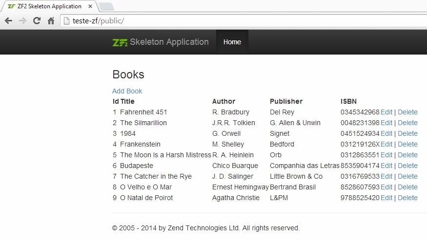
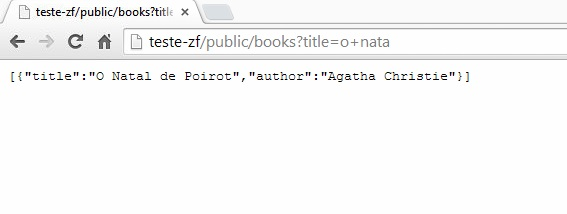
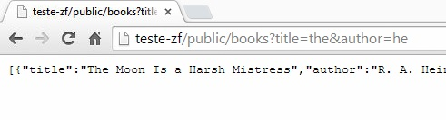
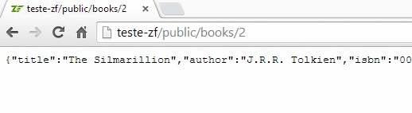

teste-zf
========

exemplo de utilização do zend framework 2 com doctrine 2 na criação de um serviço de restful json

este projeto contêm os seguintes recursos implementados

	crud simples para inserção, edição e delete de livros
	api restful que permite a pesquisa de livros, bem como acesso a informações detalhadas de um específico

a api restfull os seguintes acessos

	/books -> lista os livros existentes 
	/books/{x} -> os dados do livro com ID {x} 

O serviço /books deve poder ser filtrado. Sendo assim, as URLs abaixo deverão ser válidas e 

retornar os dados esperados: 

	/books?author=J.R.R.+Tolkien 
	/books?title=The+Lord 
	/books?title=The+Lord&author=J.R.R.+Tolkien

Para acesso ao crud deve-se ir para a home / ou acessar a url /bookscrud

